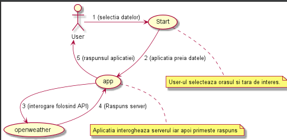
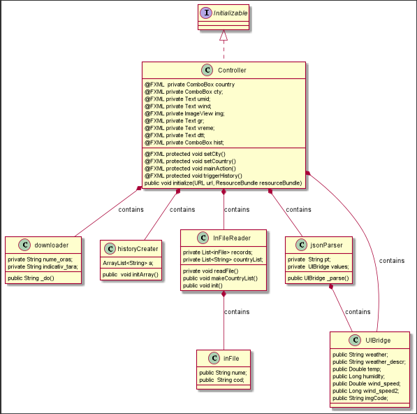
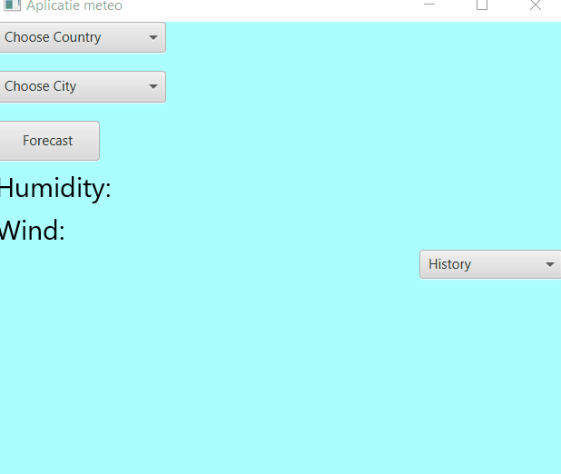

# Aplicatie meteo:
- Aceasta este o aplicatie grafica de windows realizata folosind tehnologia fxml din cadrul java
- Pentru crearea diagramelor am folosit plug-in-ul plantUml din cadrul intelij
- Pentru ca programul sa mearga este nevoie de integrarea bibliotecilor precizate mai jos in cadrul proiectului

### Cerinte de sistem:
- https://gluonhq.com/download/javafx-15-0-1-sdk-windows/  + dezarhivarea acestora si folosirea caii in cadrul librariilor
- --module-path <calea_unde_ati_dezarhivat_biblioteca_javafx>\lib --add-modules javafx.controls,javafx.fxml in cadrul VM options 
- json-simple-1.1.1.jar regasit pe (https://code.google.com/archive/p/json-simple/downloads)

# Diagrame

## Use case

## Class diagram

# Demo

